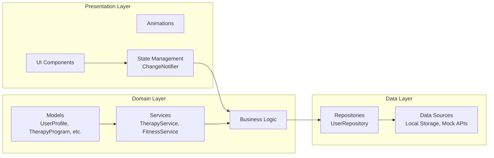
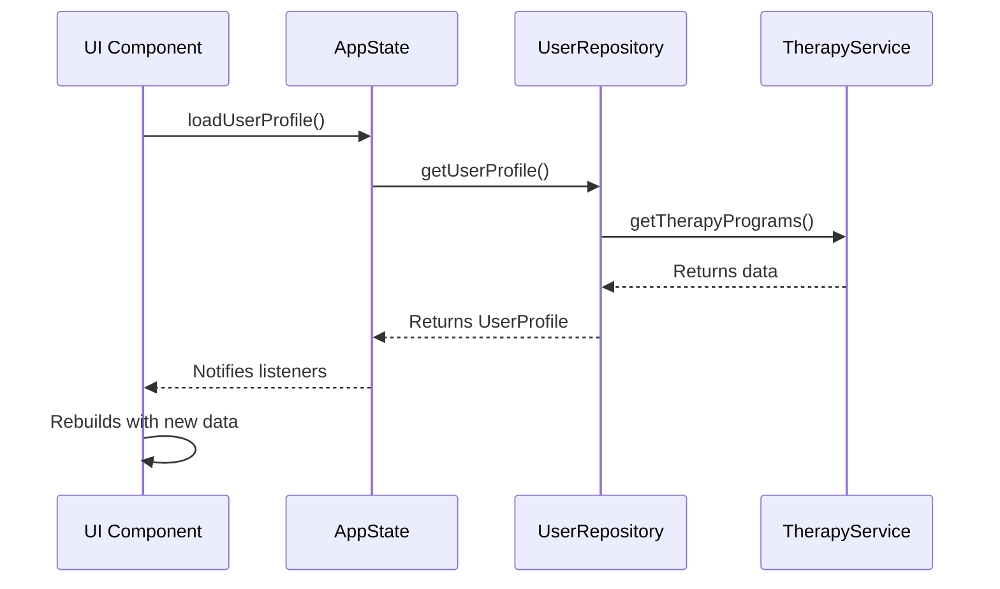

# V O L E R - Futuristic Fitness & Therapy App

  

*A modern, futuristic fitness and medical therapy application built with Flutter, specifically designed for the Egyptian market*

## 🚀 Overview

Futear is a cutting-edge fitness and therapy application that combines modern UI design with advanced functionality. Built with Flutter and following SOLID principles, it offers personalized fitness programs, therapy sessions, and nutrition guidance tailored for the Egyptian market.

  

## ✨ Features

- 🏋️ **Personalized Fitness Programs** - Tailored workouts for all levels
- 💆 **Therapy Sessions** - Mental and physical wellness programs
- 🥗 **Nutrition Guidance** - Mediterranean diet plans and Ramadan nutrition
- 📊 **Activity Tracking** - Monitor steps, workout minutes, and progress
- 🌍 **Egyptian Focus** - Culturally relevant content and Arabic support
- 🎨 **Modern UI** - Glassmorphism, animations, and dark theme
- 🔒 **Privacy Focused** - Your data stays on your device

## 🏗️ Project Architecture

### High-Level Structure
V O L E R App
├── Presentation Layer
├── Domain Layer
└── Data Layer 

### Detailed Architecture

---
## State Management Flow

## development process be like 
---

  

